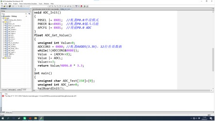
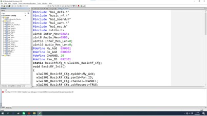
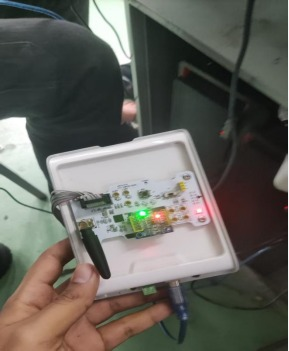

# CC2530 Wireless Light Monitoring System

[](https://opensource.org/licenses/MIT)
[](https://www.ti.com/product/CC2530)
[](https://www.iar.com/ew8051)

## 📌 Overview

This project implements a **wireless light monitoring system** using two **TI CC2530** modules communicating through the **BasicRF protocol**.

The system uses a light sensor to measure light intensity through the CC2530 ADC. The measured voltage is transmitted wirelessly from the transmitter board to the receiver board. The receiver processes the received data, controls LEDs according to predefined light-level thresholds, and sends formatted measurement data to a PC through UART.

### System Components

- **Board B (Transmitter):** Reads light intensity using the ADC and transmits the measured voltage wirelessly.
- **Board A (Receiver):** Receives the transmitted data, controls LEDs according to the light level, and sends formatted data to a PC through UART.

---

## ✨ Features

- **Wireless Communication:** BasicRF protocol for communication between two CC2530 modules.
- **Light Intensity Sensing:** Measures sensor voltage using the CC2530 ADC.
- **Automatic LED Feedback:** LEDs indicate different light levels.
- **UART Output:** Sends formatted light-intensity data to a PC at **115200 baud**.
- **Configurable Network:** Customizable device addresses, RF channel, and PAN ID.
- **Customizable UART Output:** Student name and class can be configured in the receiver code.

### LED Behavior

- **Voltage > 1.5V:** All LEDs OFF — Bright light
- **Voltage 0.5V–1.5V:** One LED ON — Moderate light
- **Voltage < 0.5V:** Two LEDs ON — Dark

---

## 📸 Project Images

### ADC Light Intensity Code



*ADC configuration and light intensity measurement code.*

### BasicRF Communication Code



*BasicRF wireless communication and system configuration code.*

### Hardware Prototype



*CC2530 wireless light monitoring hardware prototype.*

---

## 🛠️ Hardware Requirements

| Component | Specification |
|-----------|---------------|
| Microcontroller | TI CC2530 2.4 GHz SoC |
| Light Sensor | Photo-resistor / Light sensor |
| LEDs | 2 × Indicator LEDs (Active Low) |
| Power Supply | 3.3V DC |
| PC Connection | UART via USB-Serial adapter |

---

## 🔌 Pin Connections

### Board B — Transmitter

| Pin | Function | Description |
|-----|----------|-------------|
| P0.0 | ADC Input | Light sensor analog input |
| P1.0 | LED1 | Indicator LED (Active Low) |
| P1.1 | LED2 | Indicator LED (Active Low) |

### Board A — Receiver

| Pin | Function | Description |
|-----|----------|-------------|
| P1.0 | LED1 | Indicator LED (Active Low) |
| P1.1 | LED2 | Indicator LED (Active Low) |
| P0.2 | UART TX | Serial output to PC |

---

## 📡 Network Configuration

The two CC2530 boards communicate using the same RF channel and PAN ID.

Example configuration:

```c
#define MY_ADDR         0x0001
#define DEST_ADDR       0x0002
#define CHANNEL         20
#define PAN_ID          0x2301
#define UART_BAUDRATE   115200
